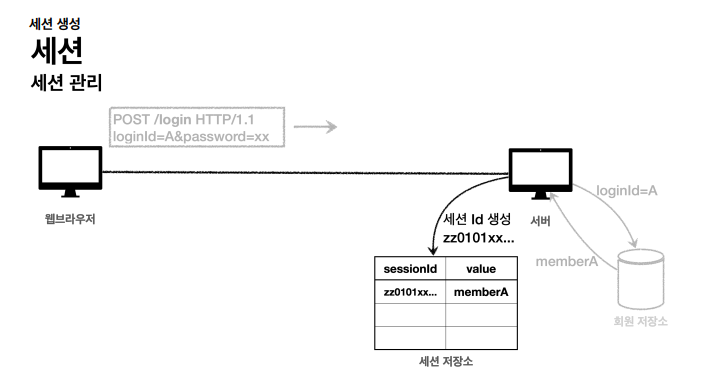

# 6. 로그인 처리1 - 쿠키, 세션

## 로그인 요구사항

- 홈 화면 필요 - 로그인 전
    - 회원 가입
    - 로그인
- 홈 화면 - 로그인 후
    - 본인 이름(누구님 환영합니다)
    - 상품 관리
    - 로그아웃
- 보안 요구 사항
    - 로그인 사용자만 상품에 접근하고, 관리할 수 있음
    - **로그인 하지 않은 사용자가 상품 관리에 접근하면, 로그인 화면으로 이동**

→ 의존 관계 설정이 중요하다.

WEB 패키지는 domain 패키지에 의존하지만, domain 패키지는 WEB 패키지에 의존하면 안된다.

유지 보수 및 추가 개발 시 더 복잡해진다.

애노테이션 @RequiredArgsConstructor 

@RequiredArgsConstructor는 Lombok 라이브러리에서 제공하는 애노테이션입니다. 이 애노테이션의 주요 기능은 다음과 같습니다:

1. 클래스의 final 필드나 @NonNull로 마크된 필드에 대한 생성자를 자동으로 생성합니다.
2. 생성자를 통해 의존성 주입을 쉽게 할 수 있게 해줍니다. 특히 Spring에서 싱글톤 빈을 사용할 때 유용합니다.
3. @Autowired 애노테이션 없이도 생성자가 하나일 경우 자동으로 의존성 주입이 가능하게 합니다.

@PostConstruct 애노테이션은 스프링 프레임워크에서 제공하는 기능으로, 해당 빈의 의존관계가 모두 주입된 후에 초기화 용도로 호출되는 메서드를 지정하는 데 사용됩니다. 주요 특징은 다음과 같습니다:

- 빈 생성 및 의존성 주입이 완료된 후 자동으로 실행됩니다.
- 주로 초기화 로직을 수행하는 데 사용됩니다.
- 테스트용 데이터를 넣는 등의 용도로 활용할 수 있습니다.

예를 들어, 다음과 같이 사용할 수 있습니다:

```java
@PostConstruct
public void init() {
    itemRepository.save(new Item("testA", 10000, 10));
    itemRepository.save(new Item("testB", 20000, 20));
}
```

이 메서드는 빈이 완전히 초기화된 후 자동으로 호출되어, 초기 데이터를 저장하는 역할을 수행합니다.

## Cookie

- 영속 쿠키 : 만료 날짜를 입력하면, 해당 날짜까지 유지
- 세션 쿠키 : 만료 날짜를 생략하면, 브라우저 종료시 까지만 유지

**LoginController - login()**

```java
@Slf4j
@Controller
@RequiredArgsConstructor
public class LoginController {
    private final LoginService loginService;
    private final SessionManager sessionManager;
    @GetMapping("/login")
    public String loginForm(@ModelAttribute("loginForm") LoginForm form) {
        return "login/loginForm";
    }

//    @PostMapping("/login")
    public String login(@Valid @ModelAttribute LoginForm form, BindingResult bindingResult, HttpServletResponse response) {
        if (bindingResult.hasErrors()) {
            return "login/loginForm";
        }
        Member loginMember = loginService.login(form.getLoginId(), form.getPassword());
        if (loginMember == null) {
            bindingResult.reject("loginFail", "아이디 또는 비밀번호가 맞지 않습니다");
            return "login/loginForm";
        }

        /**
         * 로그인 처리 로직 (쿠키)
         * 로그인 처리 된 쿠키를 보내주고
         * 이후 로그인 이후 접근할 시 쿠키를 함께 보내준다.
         * 영속 쿠키 vs 세션 쿠키
         * 세션 쿠키 -> 브라우저 종료시 까지만 유지한다 -> 이걸 사용한다.
         */

        Cookie idCookie = new Cookie("memberId", String.valueOf(loginMember.getId()));
        response.addCookie(idCookie);

        return "redirect:/";
    }

//    @PostMapping("/logout")
    public String logout(HttpServletResponse response) {
        expireCookie(response, "memberId");
        return "redirect:/";
    }
}
```

**쿠키 생성 로직**

```java
Cookie idCookie = new Cookie("memberId", String.valueOf(loginMember.getId()));
response.addCookie(idCookie);
```

로그인에 성공하면, 쿠키를 생성하고, `HttpServletResponse` 에 담는다.

쿠키 이름은 memberId 이고, 값은 회원의 id를 담는다. 그리고 웹 브라우저는 종료 전까지 회원의 id를 서버에 계속 보내준다.

→ 홈에서는 로그인 된 User는 쿠키를 들고 있을 것이니, 쿠키 값이 있는지 확인하고 

null 이면 → home

null 이 아니면 → loginHome

보내주면 된다.

**HomeController - homeLogin()**

```java
@Slf4j
@Controller
@RequiredArgsConstructor
public class HomeController {

    private final MemberRepository memberRepository;
    private final SessionManager sessionManager;

    @GetMapping("/")
    public String homeLogin(@CookieValue(name = "memberId", required = false) Long memberId, Model model) {
        if (memberId == null) {
            return "home";
        } else {
            // 로그인 성공 시
            Member loginMember = memberRepository.findById(memberId);
            if (loginMember == null) {
                return "home";
            }
            model.addAttribute("member", loginMember);
            return "loginHome";
        }
    }
}
```

- @CookieValue 의 이름은 우리가 보낸 쿠키의 이름 “memberId” 로 설정, required 는 로그인 하지 않은 사용자도 접근할 수 있기에 false 로 설정함.

**HomeController - logout()**

```java
@PostMapping("/logout")
public String logout(HttpServletResponse response) {
    expireCookie(response, "memberId");
    return "redirect:/";
}
    
private static void expireCookie(HttpServletResponse response, String cookieName) {
    Cookie cookie = new Cookie(cookieName, null);
    cookie.setMaxAge(0);
    response.addCookie(cookie);
}
```

로그아웃 시, memberId 라는 쿠키를 새로 만들고, 해당 쿠키의 종료 날짜를 0으로 설정하고 response 에 만든 쿠키를 추가한다. 그리고 이를 redirect:/  홈 화면으로 리다이렉트 하며 해당 쿠키를 전송한다.

## 쿠키와 보안 문제

→ 브라우저에서 쿠키의 값은 임의로 바꿀 수 있고, 다른 사람의 쿠키 값인 “memberId” 값을 알면, 내가 다른 사람으로 로그인도 가능하다. 

**대안**

- 쿠키에 중요한 값을 노출하지 않고, 사용자가 예측 불가한 임의의 토큰을 사용하고, 서버에서 토큰과 사용자 id 를 매핑하여 인식한다. 그리고 서버에서 토큰을 관리한다.
- 토큰은 임의의 값으로 알 수 없어야 한다.
- 토큰이 도난당하더라도, 시간이 지나면 동일한 토큰을 사용하지 못하도록 토큰의 만료 시간을 짧게 설정한다.(기본 30분 = 1800초)



- sessionId 를 사용하는 임의의 랜덤한 토큰 → UUID 를 사용하여 만든다.


- **클라이언트와 서버는 결국 쿠키로 연결이 되어야 한다.**
    - 서버는 클라이언트에 “mySessionId” 라는 이름으로 세션 ID 인 토큰 값만 쿠키에 담아 전달한다.
    - 클라이언트는 쿠키  저장소에 “mySessionId” 쿠키를 보관한다.


- 클라이언트는 요청 시 항상 “mySessionId” 쿠키를 전달하고
- 서버에서는 클라이언트가 전달한 “mySessionId” 쿠키 정보로 세션 테이블을 조회하고 로그인 시 보관한 세션 정보를 사용한다.

### 로그인 처리하기 - 세션 직접 만들어 보기

```java
@Component
public class SessionManager {
    public static final String SESSION_COOKIE_NAME = "mySessionId";
    private Map<String, Object> sessionStore = new ConcurrentHashMap<>();

    /**
     * 세션 생성
     */
    public void createSession(Object value, HttpServletResponse response) {
        //세션 id 를 생성하고 값을 세션에 저장
        String sessionId = UUID.randomUUID().toString();
        sessionStore.put(sessionId, value);
        Cookie mySessionCookie = new Cookie(SESSION_COOKIE_NAME, sessionId);
        response.addCookie(mySessionCookie);
    }

    public Object getSession(HttpServletRequest request) {
        Cookie sessionCookie = findCookie(request, SESSION_COOKIE_NAME);
        if (sessionCookie == null) {
            return null;
        }
        return sessionStore.get(sessionCookie.getValue());

    }

    public Cookie findCookie(HttpServletRequest request, String cookieName) {
        Cookie[] cookies = request.getCookies();
        if (cookies == null) {
            return null;
        }
        return Arrays.stream(cookies).filter(cookie -> cookie.getName().equals(cookieName)).findAny().orElse(null);
    }

    /**
     * 세션 만료
     */

    public void expire(HttpServletRequest request) {
        Cookie sessionCookie = findCookie(request, SESSION_COOKIE_NAME);
        if (sessionCookie != null) {
            sessionStore.remove(sessionCookie.getValue());
        }
    }
}
```

- 동시성 문제를 해결하기 위해 `ConcurrentHashMap<>` 사용함.

### 로그인 처리하기 - 직접 만든 세션을 사용하기

**LoginController - loginV2()**

```java
@PostMapping("/login")
public String loginV2(@Valid @ModelAttribute LoginForm form, BindingResult bindingResult, HttpServletResponse response) {
    if (bindingResult.hasErrors()) {
        return "login/loginForm";
    }
    Member loginMember = loginService.login(form.getLoginId(), form.getPassword());
    if (loginMember == null) {
        bindingResult.reject("loginFail", "아이디 또는 비밀번호가 맞지 않습니다");
        return "login/loginForm";
    }

    /**
     * 로그인 처리 로직 (쿠키)
     * 로그인 처리 된 쿠키를 보내주고
     * 이후 로그인 이후 접근할 시 쿠키를 함께 보내준다.
     * 영속 쿠키 vs 세션 쿠키
     * 세션 쿠키 -> 브라우저 종료시 까지만 유지한다 -> 이걸 사용한다.
     */

    /**
     *
     * 세션 관리자를 통해 세션을 생성하고, 회원 데이터를 보관
     */
    sessionManager.createSession(loginMember, response);

    return "redirect:/";
}
```

**LoginService - login()**

```java
@Service
@RequiredArgsConstructor
public class LoginService {
    private final MemberRepository memberRepository;

    /**
     * return 이 null 이면 로그인 실패
     */
    public Member login(String loginId, String password) {
//        Optional<Member> findMemberOptional = memberRepository.findByLoginId(loginId);
//        Member member = findMemberOptional.get();
//        if (member.getPassword().equals(password)) {
//            return member;
//        } else {
//            return null;
//        }
//        Optional<Member> findMemberLoginId = memberRepository.findByLoginId(loginId);
//        return findMemberLoginId.filter(member -> member.getPassword().equals(password)).orElse(null);
        return memberRepository.findByLoginId(loginId).filter(member -> member.getPassword().equals(password)).orElse(null);
    }
}
```

**LoginController - logoutV2()**

```java
@PostMapping("/logout")
public String logoutV2(HttpServletRequest request) {

    sessionManager.expire(request);
    return "redirect:/";
}
```

**HomeController - homeLoginV2()**

```java
@GetMapping("/")
public String homeLoginV2(HttpServletRequest request, Model model) {
    Member member = (Member) sessionManager.getSession(request);

    if (member == null) {
        return "home";
    }
    model.addAttribute("member", member);
    return "loginHome";
}
```

- request 에서 sessionManager의 getSession 통해 request 의 쿠키 값을 읽고, 해당 쿠키 값이 키로 설정된 value 를 찾아 return 받는다. 세션에서 찾지 못한다면, null 을 return 받는다.

 

## 로그인 처리하기 - 서블릿 HTTP 세션 1

**우리가 구현한 세션은 서블릿에서 HttpSession 이라는 기능으로 제공한다.**

이를 적용해보자.

### HttpSession 사용

**SessionConst**

```java
public interface SessionConst {
    String LOGIN_MEMBER = "loginMember";
}
```

**LoginController - loginV3()**

```java
@PostMapping("/login")
public String loginV3(@Valid @ModelAttribute LoginForm form, BindingResult bindingResult, HttpServletRequest request) {
    if (bindingResult.hasErrors()) {
        return "login/loginForm";
    }
    Member loginMember = loginService.login(form.getLoginId(), form.getPassword());
    if (loginMember == null) {
        bindingResult.reject("loginFail", "아이디 또는 비밀번호가 맞지 않습니다");
        return "login/loginForm";
    }
    HttpSession session = request.getSession();
    session.setAttribute(SessionConst.LOGIN_MEMBER, loginMember);
    return "redirect:/";
}
```

- 로그인 된 정보를 세션에 저장하고, 해당 키 값을 uuid 로 만들어 키를 쿠키에 저장하여 넘겨준다.

**LoginController - logoutV3()**

```java
@PostMapping("/logout")
public String logoutV3(HttpServletRequest request) {
    HttpSession session = request.getSession(false);
    if (session != null) {
        session.invalidate();
    }
    return "redirect:/";
}
```

`session.invalidate();` 를 사용하면, 해당 세션을 제거할 수 있다.

## 로그인 처리하기 - 서블릿 HTTP 세션 2

### @SessionAttribute

스프링에서 세션을 더 편리하게 사용할 수 있도록 제공하는 애노테이션.

**HomeController - homeLoginSpring()**

```java
@GetMapping("/")
    public String homeLoginSpring(@SessionAttribute(name = SessionConst.LOGIN_MEMBER, required = false) Member loginMember, Model model) {
        if (loginMember == null) {
            return "home";
        }
        model.addAttribute("member", loginMember);
        return "loginHome";
    }
```

- 세션을 찾고, 세션에 들어있는 데이터를 찾는 번거로움을 스프링이 한번에 처리해준다.

**→ 단, 세션을 생성하는 기능은 아니다. 따라서, 쿠키 값을 통해 세션에서 value 를 찾아올 때 유용함.**

→ 실행 결과 : 웹 브라우저가 처음 접속하여 쿠키를 지원하지 않을 때(쿠키 값이 없을 때) URL 을 통해 세션을 유지하기 위해, URL 에 `jsessionid=` 값이 붙어 나온다. 이를 끄고 항상 쿠키만 통해서 세션을 유지하고 싶다면, 

**application.properties**

```java
server.servlet.session.tracking-modes=cookie
```

추가하자.